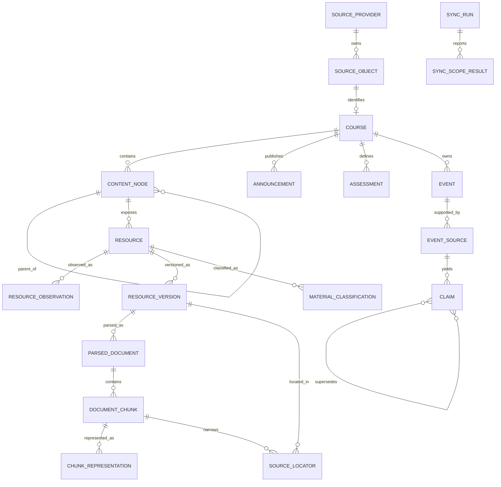

# Data model

## Modeling rules

The relational model uses private local surrogate keys for joins, while source identifiers are
typed values. In Python-facing interfaces, distinct wrappers such as `CourseId`, `ContentId`,
`AttachmentId`, `AnnouncementId`, `AssessmentId`, `GradingColumnId`, and `CalendarItemId`
prevent namespace mistakes. Each wrapper includes a provider name and an opaque provider value.
No public API accepts a context-free `id: str`.

Database primary keys such as `course_key` and `resource_key` are implementation-local identities;
they are not remote identifiers. A generic `SourceObject` envelope may support provenance and
future providers, but it always carries a checked `object_kind`. Domain tables retain their typed
foreign keys and constraints.

## Core entities

| Entity | Responsibility and important fields |
| --- | --- |
| `SourceProvider` | Provider instance and capability set. Initially only NTULearn. |
| `SourceObject` | Typed source identity: `provider`, `object_kind`, `remote_key`, first/last observed time. It never stores ephemeral signed URLs. |
| `Course` | Stable local course key; typed remote course identity; current code/title/term; availability; first/last observed time. A code is display metadata, not identity. |
| `ContentNode` | A node in the real ordered content tree: typed content identity, course, parent node, handler kind, title, position, availability, and sanitized metadata. Parent may be null at a synthetic local root. |
| `Resource` | A logical downloadable course resource, related to a content node and typed attachment/source identity. Holds display title, original filename observations, lifecycle state, and current verified version. |
| `ResourceObservation` | What one sync run observed about a resource: sync-run key, observation status, sanitized metadata snapshot/fingerprint, candidate modification fields, availability, observed time, fetch decision, and linked verified version when known. |
| `ResourceVersion` | Immutable verified binary evidence for one logical resource: SHA-256, byte size, detected format, MIME evidence, download time, blob path, browse path, and verification status. |
| `MaterialClassification` | Semantic purpose such as `lecture_slides` or `assignment_brief`, with method, confidence, model/rule version, evidence, and validity interval. It is independent of `file_format`. |
| `ParsedDocument` | One parser result for one resource version, keyed by parser name/version and settings hash; records state, coverage, and errors. |
| `DocumentChunk` | Retrieval unit such as a PDF page, PPTX slide, DOCX section, paragraph group, or table. Stores ordered text, structural kind, and parent document. |
| `ChunkRepresentation` | Non-destructive representations of a chunk: native text, structured elements, OCR text, vision description, or rendered derivative, each with method and confidence. |
| `SourceLocator` | Exact locator within immutable evidence: resource version, chunk, page/slide/section/table coordinates, element index, and optional character span. |
| `Announcement` | Typed announcement identity, course, title/body, distinct creation/modification/publication/availability times, source observation, and lifecycle state. |
| `Assessment` | Typed assessment and optional grading-column identities, course/content relation, subtype, instructions, availability/open/close/due times, and source observation. |
| `Event` | Canonical local interpretation of a logical course event. It contains accepted field projections, never the only copy of source evidence. |
| `EventSource` | One source-specific event mention linked to an announcement, assessment, calendar item, content item, or document locator. Holds extracted candidate fields and source-specific timing. |
| `Claim` | An atomic assertion about an event field, for example `due_time`, `location`, or `status`; it retains value, confidence, decision state, and supersession links. |
| `ExtractionRecord` | Reproducibility record for classification or extraction: extractor/version, settings hash, input version, run time, outcome, and warnings. |
| `SyncRun` | One synchronization attempt: requested mode/scope, start/end, run status, counts, warnings, and redacted error categories. |
| `SyncScopeResult` | Coverage for one provider/course/data-kind/window within a run, including pagination completion and failure details. |
| `SyncState` | Latest attempt, success, complete observation, checkpoint/capability metadata, and staleness for a precise scope. |

## Relationships



`EventSource` can point to a typed source object, a `SourceLocator`, or both. The relational
schema should use constrained nullable foreign keys plus a source-kind check rather than an
unchecked arbitrary JSON reference.

## Resource and version semantics

`Resource` answers “which logical attachment is this?” `ResourceVersion` answers “which exact
bytes were verified?” `ResourceObservation` answers “what did the provider show during this
sync?” These are deliberately different:

```text
Resource: Week 3 Slides
  typed remote attachment identity: attachment_456
  current_version: v2

ResourceObservation O1: metadata M1, observed at T1 -> v1
ResourceVersion v1: SHA-256 A, immutable local bytes

ResourceObservation O2: metadata M2, observed at T2 -> v1
  metadata changed, bytes did not

ResourceObservation O3: metadata M3, observed at T3 -> v2
ResourceVersion v2: SHA-256 B, immutable local bytes
```

A new hash creates a new version. A repeated hash records a new observation and reuses the
version. A metadata-only observation may have no linked version until policy chooses to fetch.
The current version changes only after the binary has been downloaded, hashed, stored, and
committed successfully.

## Semantic type and physical format

`MaterialClassification.semantic_type` is a controlled, extensible vocabulary:

- `lecture_slides`
- `tutorial`
- `lab_manual`
- `assignment_brief`
- `syllabus`
- `assessment_information`
- `reading`
- `reference`
- `unknown`

`ResourceVersion.file_format` describes the bytes, for example `pdf`, `docx`, `pptx`, or
`unknown`. Classification uses titles, content-tree context, source metadata, and extracted
content; an extension is only format evidence. Multiple classification candidates may coexist,
with one selected current result and an audit trail.

## Time model

Times are named by meaning. Relevant columns include:

- `created_at_source`, `modified_at_source`, and `published_at_source`;
- `available_from`, `available_until`, and assessment `open_at`/`close_at`;
- event `start_time`, `end_time`, and `due_time`;
- evidence `source_timestamp` and `observed_at`;
- local `downloaded_at`, `parsed_at`, `extracted_at`, and `synchronized_at`.

Instants are normalized to UTC while retaining the source timezone, source text, and precision.
Date-only and week-only claims remain partial temporal values; they are not fabricated into exact
instants. `due_time` is never copied into `start_time` merely to fit a calendar representation.

## Status and coverage vocabularies

Resource visibility is independent from sync coverage:

- `ACTIVE`: currently observed and accessible in a complete relevant scope.
- `MISSING`: absent from a complete inventory; deletion is not established.
- `UNAVAILABLE`: explicitly present but not currently readable or available.
- `REMOVED_CONFIRMED`: explicit authoritative deletion evidence or an explicit local decision.
- `UNKNOWN`: state cannot be established.

Coverage is always scoped and uses `COMPLETE`, `PARTIAL`, `STALE`, `UNKNOWN`, or `FAILED`.
`COMPLETE` means every advertised page in the stated provider/course/data-kind/window was
traversed successfully; it is never a global claim about NTULearn.

## Event fields

An `Event` includes a stable local event key, course, type, title, `start_time`, `end_time`,
`due_time`, `all_day`, timezone, location, canonical status, confidence, local creation/update
times, resolution state, and derived source count. Supported types begin with:

`assignment_due`, `quiz`, `test`, `exam`, `presentation`, `tutorial`, `lab`, `lecture`,
`project_milestone`, `submission`, `course_change`, `cancellation`, `venue_change`, and
`generic_course_event`.

Event fields are projections of accepted claims. The provenance-bearing claims and rejected or
superseded alternatives remain queryable.
