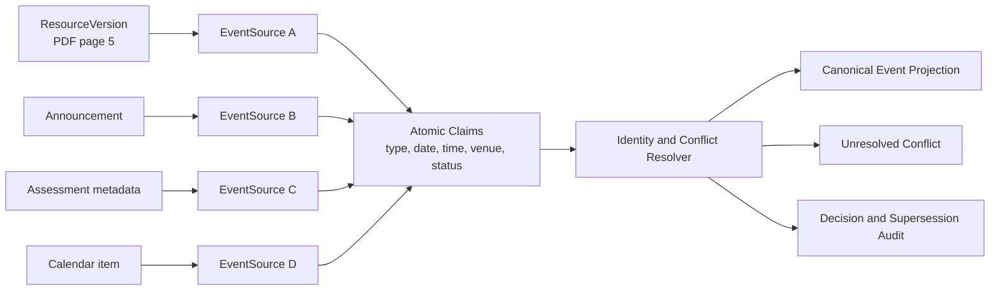

# Events, evidence, and reconciliation

## Why claims are first-class

An event is a current local interpretation, while sources can be incomplete, complementary, or
contradictory. Storing only one flattened event would erase why a field was chosen and what it
replaced. The architecture therefore uses a first-class `Claim` entity for atomic assertions and
keeps every source-specific event mention.



## Provenance chain

Every important extracted fact can resolve through:

```text
source provider
  -> typed source object or logical Resource
  -> immutable ResourceVersion when file-backed
  -> DocumentChunk (page, slide, section, table, ...)
  -> SourceLocator (element and optional character span)
  -> EventSource
  -> Claim
  -> canonical Event field
```

A synthetic citation might render as:

```text
PH0000 / lecture_slides / Week 3 Slides / version sha256:12ab... / page 12
```

The locator stores structured fields, not only a display string. File-backed locators include the
version hash so that page 12 cannot silently refer to replacement bytes. Announcement, assessment,
calendar, and content metadata use typed source-object locators and a source observation.

## EventSource

One `EventSource` represents one event mention from one evidence context. It records:

- source type and typed source object;
- optional resource version and precise locator;
- extracted source wording or privacy-safe bounded text span;
- candidate title, type, temporal fields, location, and status;
- source publication/modification/effective timestamp with its exact meaning;
- local `observed_at`;
- extraction method, extractor version, and confidence;
- relation to an `ExtractionRecord`;
- identity-resolution state and explanation.

Source-specific detail is preserved even when it is not selected for the canonical event.

## Claim model

A `Claim` is an assertion about one event attribute:

```text
event candidate: Quiz 1
field: start_time
value: 2027-02-10T10:00:00+08:00
precision: exact_time
decision: ACCEPTED | SUPERSEDED | CONFLICTING | REJECTED | UNRESOLVED
confidence: HIGH | MEDIUM | LOW, plus optional calibrated score
event_sources: [source_a, source_b]
supersedes: [older_claim]
reason: newer explicit rescheduling statement
```

Structured values use field-specific columns where queried often and a versioned typed-value
encoding for less common fields. Original text, normalized value, timezone, and precision are all
retained. Claims can support event type, title, start/end/due time, all-day status, location,
event status, scope, or other future attributes.

An event's canonical row is a projection of currently accepted claims. Rebuilding that projection
does not delete older claims or evidence.

## Candidate identity resolution

Entity resolution is conservative and explainable. It first blocks impossible pairs, then evaluates
evidence:

1. Require the same course unless an explicit cross-source mapping exists.
2. Require compatible event types; a submission deadline and a lecture are not merged because their
   titles are similar.
3. Prefer exact assessment/source relations or shared typed identifiers when present.
4. Compare normalized titles and aliases such as “Quiz 1”, “Quiz #1”, and “First Quiz”.
5. Compare partial or exact dates within a type-specific window; do not treat a due time as a start
   time.
6. Use content-tree context, assessment number, module/week labels, and related source links.
7. Check hard contradictions such as different assessment numbers or incompatible dates.

A high-confidence linkage creates or attaches to one event. Borderline candidates stay
`UNRESOLVED` and are returned as possible matches. The system never merges solely on fuzzy title
similarity, and user confirmation is stored as an explicit resolution decision.

## Conflict and supersession

Reconciliation is field-specific. It does not use a global rule such as
`Announcement > PDF > Calendar`. For each competing claim it considers:

- whether the source addresses the exact event and field;
- whether a structured field has precise semantics, such as an assessment due time;
- source publication/effective time and local observation time;
- explicit update language such as moved, postponed, corrected, or cancelled;
- relation to the official assessment or content object;
- temporal precision and extraction confidence;
- agreement among independent sources;
- whether the newer evidence is actually a clarification rather than a different event.

An explicit, newer rescheduling statement may supersede an older schedule claim, while the older
claim remains `SUPERSEDED` with a directed link and recorded reason. A newer but vague source does
not automatically replace an older exact value. Availability dates do not compete with due dates
because they are different fields.

If no defensible winner exists, both claims remain `CONFLICTING`, the canonical field is absent or
marked uncertain, and retrieval surfaces the conflict. Manual resolution chooses a claim or enters
a new user claim without deleting source evidence.

## Event semantics

Initial event types are `assignment_due`, `quiz`, `test`, `exam`, `presentation`, `tutorial`, `lab`,
`lecture`, `project_milestone`, `submission`, `course_change`, `cancellation`, `venue_change`, and
`generic_course_event`.

Event status is distinct from reconciliation state. Suggested status values are `SCHEDULED`,
`TENTATIVE`, `CANCELLED`, `COMPLETED`, and `UNKNOWN`; resolution state is `RESOLVED`, `UNRESOLVED`,
or `CONFLICTING`. A cancellation or venue-change source may either update an existing event through
claims or remain a related change event when the target cannot be resolved.

`start_time`, `end_time`, and `due_time` coexist. An assignment may have only `due_time`; a test may
have start/end; an all-day date preserves date precision and timezone. Course-week expressions stay
partial until a separately evidenced term/calendar mapping can resolve them.

## Reproducibility and audit

Each automated decision records algorithm/ruleset version, considered candidate keys, accepted and
rejected signals, result, confidence, and time. Re-running a newer resolver creates a new decision
record and projection; it does not rewrite the previous audit. The user can inspect:

- all sources for an event;
- the selected claim for each field;
- conflicting and superseded claims;
- the reason a candidate was merged or left unresolved;
- source coverage and freshness at query time.
