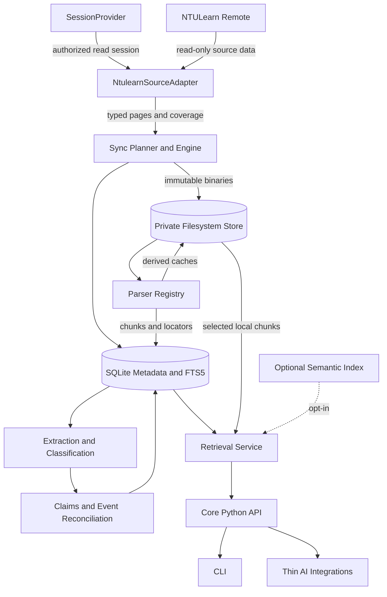

# Architecture overview

## Status and scope

This is the Phase 2 architecture for a local-first, privacy-first, provenance-aware,
incrementally synchronized course knowledge system. It is a design, not an implementation.
The first source provider will be NTULearn, but the domain, evidence, event, and retrieval
models do not assume that NTULearn is the only possible source.

All examples are synthetic. Runtime data belongs under `~/.ntulearn-skill/`, outside this
repository.

## Evidence boundary

The design is constrained by the de-identified conclusions from bounded Phase 1
reconnaissance:

| Level | Architecture-relevant conclusion |
| --- | --- |
| `CONFIRMED` | Accessible courses can be discovered through a paginated membership read path. |
| `CONFIRMED` | Course-authored content varies across folders, modules, weeks, direct files, document containers, attachments, and custom items. A generic tree is required. |
| `CONFIRMED` | Course, content, attachment, announcement, assessment, grading-column, and calendar-related identifiers occupy distinct namespaces. |
| `CONFIRMED` | Announcements, assessment metadata, due-date items, ordinary schedule items, and attachment bodies are separate information sources. Calendar data alone is incomplete. |
| `CONFIRMED` | PDF text can retain physical-page provenance; DOCX text must include paragraphs and tables; cached page indexes can support local partial reads. |
| `CONFIRMED` | A repeated local download can be compared by cryptographic hash, while preview redirect metadata is not reliable binary-version evidence. |
| `OBSERVED` | Some remote objects expose modification fields, but their semantics across real edits are not established. Source identifiers were stable only within the bounded observation. |
| `OBSERVED` | Lecture materials in the bounded corpus were predominantly PDF. This does not establish that PPTX is absent. |
| `HYPOTHESIS` | Metadata-first comparison plus binary-hash fallback is a useful update strategy. Phase 2 adopts it with explicit uncertainty and periodic verification. |
| `UNKNOWN` | Long-term identifier stability, large-list pagination behavior, original-file validators, precise delta-sync support, authentication renewal, signed-link lifetime, scanned-PDF coverage, and real PPTX behavior remain unverified. |

An `UNKNOWN` never becomes a platform contract here. Each dependent optimization is either
capability-gated, replaceable, or allowed to fall back to a slower local-safe path.

## System architecture

The arrows represent dependencies, not a single mandatory batch pipeline. Parsing,
extraction, indexing, and reconciliation are idempotent jobs keyed by exact input versions.
A failed downstream job does not invalidate a successfully downloaded original.

## Module boundaries

| Module | Responsibility | Must not do |
| --- | --- | --- |
| `client.auth` | Provide an authorized, read-only session through a narrow interface. | Expose cookies, tokens, or SSO details to domain code. |
| `client.ntulearn` | Translate NTULearn-specific reads into typed internal records and coverage reports. | Persist signed transport URLs or make storage decisions. |
| `sync` | Plan scopes, traverse pages, record observations, detect candidates for change, fetch resources, and report coverage. | Interpret document content or silently treat absence as deletion. |
| `storage` | Own SQLite transactions, migrations, immutable blobs, browseable material views, and private paths. | Use a pathname as domain identity or store credentials. |
| `parsers` | Convert a binary version into uniform document chunks and representations. | Infer course-material semantics from file extensions. |
| `extractors` | Classify materials and extract candidate claims/events with provenance. | Overwrite source text or declare a fused canonical event. |
| `reconciliation` | Resolve candidate identity, conflicts, supersession, and canonical projections with an audit trail. | Force ambiguous candidates to merge. |
| `search` | Maintain deterministic FTS and optional semantic indexes. | Require a network embedding provider for baseline operation. |
| `core` | Expose stable use cases, typed results, freshness policy, and errors. | Depend on CLI or any AI product. |
| `cli` | Map commands and presentation to core use cases. | Contain source, parsing, or reconciliation logic. |
| `integrations` | Translate AI intents to core calls and render structured provenance. | Scrape NTULearn or bypass the core. |

## Architectural invariants

- The content hierarchy is a general ordered tree; `Week -> Lecture -> File` is only one
  possible presentation.
- Remote identifiers are typed at API boundaries. A generic string is never accepted where
  two remote namespaces could be confused.
- `semantic_type` describes instructional purpose; `file_format` describes physical bytes.
- Publication, modification, availability, due, start, end, observation, and synchronization
  times are distinct fields.
- Original evidence is immutable. Derived text, classifications, claims, and canonical events
  may be recomputed without destroying history.
- A query result carries provenance, freshness, coverage, and unresolved conflicts. An empty
  result with incomplete coverage is not a claim that nothing exists.
- Remote access is targeted synchronization, never a hidden prerequisite for ordinary local
  retrieval.
- Missing once never deletes a local resource, and no signed URL is durable identity.

## Trust and privacy boundaries

There are three boundaries:

1. The remote/auth boundary contains session mechanics and ephemeral transport details.
2. The private runtime boundary contains user data, SQLite databases, binaries, indexes,
   caches, and redacted operational logs.
3. The public repository contains code, schemas, documentation, and synthetic fixtures only.

The public project can be built and tested without crossing either private boundary.

## Detailed design

- [Data model](data-model.md)
- [Local storage](storage.md)
- [Synchronization and freshness](synchronization.md)
- [Parsing and indexing](parsing-and-indexing.md)
- [Events and provenance](events-and-provenance.md)
- [Retrieval and interfaces](retrieval-and-interfaces.md)
- [Authentication and source boundaries](authentication-and-source-boundaries.md)
- [Testing and Phase 3 plan](testing-and-implementation.md)
- [Architecture review checklist](review-checklist.md)
