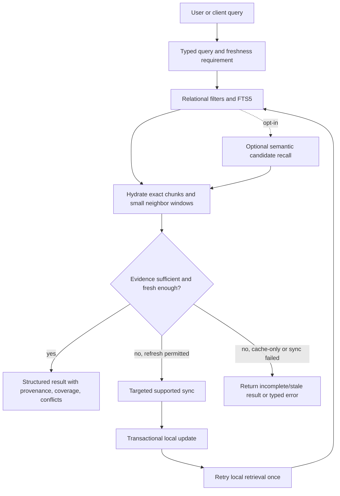

# Retrieval and interfaces

## Local-first query pipeline



The retrieval service never reads an entire original merely because one page matched. It selects
indexed entities and chunks first, then hydrates only the exact chunk and a configurable local
neighbor window. A verified resource version can answer historical content questions without a
remote request.

“Enough evidence” is deterministic and use-case-specific: required fields present, locators
resolvable, coverage acceptable, no unacknowledged hard conflict, and freshness policy satisfied.
The service retries after at most one planned synchronization cycle; it does not loop remote reads.

## Result envelope

Every core query returns data plus context:

```text
QueryResult[T]
  items: list[T]
  provenance: list[ProvenanceView]
  coverage: list[CoverageView]
  freshness: as_of + staleness by scope
  conflicts: list[ConflictView]
  warnings: list[SafeWarning]
  completeness: COMPLETE | PARTIAL | STALE | UNKNOWN | FAILED
```

An empty `items` list is conclusive only within explicitly complete and sufficiently fresh scopes.
Otherwise presentation must say “not found in the available local coverage,” not “does not exist.”

## Core service API

The future Python API uses typed references and request objects. Names below define responsibility,
not final Python syntax:

```text
list_courses(filter, freshness) -> QueryResult[CourseSummary]

quick_sync(scope, policy) -> SyncResult
sync_course(course: CourseRef, policy) -> SyncResult
sync_all(policy) -> SyncResult
fetch_resource(resource: ResourceRef, verify) -> ResourceVersionResult

list_materials(course: CourseRef, filter, freshness) -> QueryResult[MaterialSummary]
get_library_status(course, freshness) -> QueryResult[LibraryStatus]
get_recent_material_changes(course, window, freshness) -> QueryResult[MaterialChangeView]
get_resource(resource: ResourceRef, version, include_local_path) -> ResourceResult

search(query: SearchQuery) -> QueryResult[SearchHit]
search_course(course: CourseRef, query: SearchQuery) -> QueryResult[SearchHit]

get_events(filter: EventFilter, freshness) -> QueryResult[EventView]
get_upcoming_events(window, course, freshness) -> QueryResult[EventView]
get_announcements(course, filter, freshness) -> QueryResult[AnnouncementView]
get_assessments(course, filter, freshness) -> QueryResult[AssessmentView]

resolve_source(locator: SourceLocatorRef, context_window) -> ProvenanceResult
resolve_event_candidate(decision: ResolutionDecision) -> EventView
```

`CourseRef`, `ResourceRef`, and `SourceLocatorRef` use local keys or the correct typed remote value;
they do not accept an ambiguous free-form identifier. Local paths are returned only when explicitly
requested because they are private presentation details.

## Error model

Expected failures are typed and include a safe message, operation, affected scope, retryability,
coverage impact, and redacted diagnostic code:

- `AuthenticationRequired` and `SessionExpired`;
- `CapabilityUnsupported`;
- `IncompleteCoverage` and `FreshnessUnsatisfied`;
- `SourceUnavailable` and `ResourceUnavailable`;
- `ParseUnsupported`, `ParseFailed`, and `ExtractionFailed`;
- `StorageFailure`, `IntegrityFailure`, and `MigrationFailure`;
- `ConflictRequiresResolution`.

Raw URLs, source payloads, headers, credentials, and private document excerpts do not appear in
default exception strings or logs. Partial data is returned only in the structured result envelope,
never disguised as success without warnings.

## CLI adapter

The CLI is a presentation adapter over the same core API:

```text
ntulearn courses

ntulearn sync
ntulearn sync PH0000
ntulearn sync --quick
ntulearn sync PH0000 --verify

ntulearn events
ntulearn events --next 7d
ntulearn events --course PH0000 --show-conflicts

ntulearn search "quiz"
ntulearn search "presentation duration" --course PH0000

ntulearn materials PH0000
ntulearn library-status --course PH0000
ntulearn recent-materials PH0000 --days 14
ntulearn source <local-locator>
```

Human output shows an `as of` time and coverage when relevant. A machine-readable mode emits a
versioned JSON schema with local opaque keys, structured provenance, and typed errors. Exit codes
distinguish successful complete results, successful partial/stale results, no matches under complete
coverage, and operational failure. Command parsing and formatting do not contain business logic.

## AI integrations

Codex, ChatGPT, and future agent integrations are thin adapters:

```text
AI question
  -> intent and explicit freshness requirement
  -> core service call
  -> structured result, provenance, coverage, and conflicts
  -> response wording
```

They do not manage authentication, call NTULearn endpoints, parse files, maintain indexes, or
reconcile events. They must preserve uncertainty in their wording and cite locators returned by the
core. If integration formats change, the source and core layers remain unchanged.

A natural-language skill may decompose a bounded Chinese or English question into several existing
typed calls and transparent lexical searches. That adapter behavior is not a new Core service and
must not be presented as general NLP. Recent-material answers use resource observation deltas;
parse or index replay timestamps do not establish a source update.

## Source-agnostic extension boundary

The evidence and query result types identify a `SourceProvider`, allowing later email, calendar, or
manual-file providers. Phase 3 implements NTULearn only. There is no generic plugin framework,
cross-provider scheduler, or universal mapping in the initial implementation; future providers can
adopt the same typed observation/evidence contracts when a concrete need appears.
