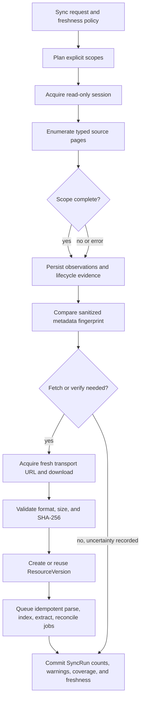

# Synchronization and freshness

## Synchronization contract

Synchronization is an explicit, read-only operation that converts provider observations into local
state. Every adapter list call returns both typed records and a coverage envelope:

```text
Page[T]
  items: list[T]
  next_cursor: optional opaque cursor
  coverage_for_page: COMPLETE | PARTIAL | UNKNOWN

ScopeResult
  provider + course + data_kind + optional time_window
  coverage: COMPLETE | PARTIAL | STALE | UNKNOWN | FAILED
  pages_seen, items_seen, warnings, observed_at
```

The sync engine follows provider-supplied pagination and records whether the entire requested scope
was traversed. It never assumes that a large requested page size was honored.

## Pipeline



The engine commits data in bounded transactions. A later fetch or parser failure does not discard
successfully enumerated metadata, but the affected scope and resource carry partial/failed state.

## Modes

### `quick_sync`

Checks high-change sources: announcements, assessments/due dates, schedule/calendar data, course
availability, and content-tree metadata/recent candidates supported by the adapter. Because a true
remote delta protocol is `UNKNOWN`, quick sync reports each scope separately. A shallow or
time-windowed check may be `COMPLETE` for that stated window and still `PARTIAL` for the full course.

### `sync_course(course)`

Traverses all supported, selected scopes for one course, including the general content tree, and
fetches resources according to download policy. Unsupported or failed scopes appear explicitly in
the result.

### `sync_all()`

Discovers accessible courses and runs `sync_course` within configured inclusion and resource
policies. “All” means all selected accessible courses and supported scopes in this run, not every
institutional or historical course.

### `fetch_resource(resource)`

Acquires a fresh ephemeral download route through the source adapter, downloads and hashes one
resource, creates/reuses a verified version, then schedules downstream local jobs. It can be invoked
by a sync policy or explicitly by the user. For a provider that declares its resource routes
discovery-bound, an explicit standalone fetch that needs source bytes first performs bounded
course/content rediscovery in the same authorization context and
requires the target attachment to be observed again. This reconstructs the adapter's in-memory
authorization graph after restart without treating persisted IDs as current authorization. If that
rediscovery is incomplete or fails, the fetch fails with a typed safe category and retains every
previously verified local version.

Provider-native delta sync, conditional requests, and stable remote validators are optional future
capabilities. The planner uses them only after live validation marks the capability supported.

## Update detection with explicit uncertainty

Remote metadata is a change signal, not binary proof. The baseline policy is:

1. Build a sanitized metadata fingerprint from stable candidate fields, excluding signed URLs,
   request headers, access timestamps, and other transport noise.
2. New typed remote identity: record a new logical object and fetch if policy allows.
3. Changed fingerprint or explicit provider revision signal: fetch and hash.
4. Unchanged fingerprint: normally skip downloading within a configurable verification interval,
   recording `UNCHANGED_ASSUMED`, not hash-verified equality.
5. Expired verification interval, explicit `--verify`, or unresolved metadata: download and hash.
6. Same SHA-256: reuse the existing version and record `UNCHANGED_HASH_VERIFIED`.
7. Different SHA-256: create a new immutable version and mark `BINARY_CHANGED`.
8. A validated future ETag or equivalent may avoid downloads, but only behind a declared adapter
   capability and with fallback to this policy.

The observation records which rule fired and what remained uncertain. The system therefore avoids
both repeat downloads on every run and unsupported claims that metadata proves byte equality.

## Conservative visibility lifecycle

Omission is evaluated only after scope coverage is known:

| Evidence | Transition |
| --- | --- |
| Object observed and readable | `ACTIVE` |
| Object explicitly present but unavailable | `UNAVAILABLE` |
| Object omitted from one complete comparable inventory | `MISSING`; retain all local data |
| Object omitted from partial, stale, unknown, or failed inventory | Preserve prior state; attach uncertain observation |
| Explicit authoritative deletion signal or explicit user confirmation | `REMOVED_CONFIRMED`; retain history |

Repeated complete omissions can raise a `removal_candidate` warning, but repetition alone does not
invent authoritative deletion semantics. A reappearing object returns to `ACTIVE` without losing
its observation history. Remote identity changes that might represent a replacement or course copy
remain separate resources until an explainable reconciliation or user decision links them.

## Freshness model

`SyncState` is keyed by provider, course, data kind, and optional time window. It records:

- `last_attempt_at` and outcome;
- `last_success_at`;
- `last_complete_at` for that exact scope;
- coverage and warnings;
- adapter capability/checkpoint metadata;
- configured maximum age and computed staleness.

Callers select a deterministic `FreshnessRequirement`:

- `CACHE_ONLY`: never access remote data.
- `ALLOW_STALE`: return local results with their age.
- `MAX_AGE(duration)`: refresh the relevant scope if older.
- `REFRESH_IF_STALE`: use the configured scope policy.
- `REQUIRE_CURRENT`: attempt a targeted sync and fail/return partial if current coverage cannot be
  established.

Historical content questions default to local retrieval when the referenced verified version is
available. Current-state intents such as “new announcements” map to configured quick-sync scopes.
This mapping is a core policy or explicit caller option; an LLM is not the sole freshness judge.

## Run status and observability

`SyncRun` status (`RUNNING`, `SUCCEEDED`, `SUCCEEDED_WITH_WARNINGS`, `FAILED`, `CANCELLED`) is
separate from per-scope coverage. A successful run can have an intentionally partial quick scope.
User-facing summaries contain counts and safe warnings, for example:

```text
sync PH0000

3 new, 2 updated, 41 unchanged, 1 unavailable, 2 warnings
coverage: announcements COMPLETE; content PARTIAL
```

Operational logs use structured event names, local opaque keys, counts, durations, and error
categories. They redact remote URLs, query strings, headers, credentials, personal text, and source
document excerpts by default.
